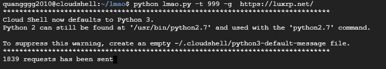

# lmao.py
Công cụ DoS cho các yêu cầu HTTP (lấy cảm hứng từ Kaisa nhưng có nhiều chức năng hơn) được viết bằng Python:


# Ví Dụ
999 threads sends GET requests:

```bash
python doser.py -t 999 -g 'https://targeted.site.com'
```

999 threads sends POST requests with json data:

```bash
python doser.py -t 999 -p 'https://targeted.site.com' -ah 'Content-Type: application/json' -d '{"json": "payload"}'
```

# Cách sử dụng
``` Nếu bạn chọn <g> thì sẽ là : python lmao.py -t 999 -g 'URL'```

```Nếu bạn chọn <p> thì sẽ là : python lmao.py -t 999 -p 'URL'```

```Nếu bạn chọn <d> thì sẽ là : python lmao.py -t 999 -d 'URL' ```


Các tùy chọn :

  -h, --help  show this help message and exit
  
  -g       -- Specify GET request. Usage: -g '< url >'
  
  -p      --  Specify POST request. Usage: -p '< url >'
  
  -d      --  Specify data payload for POST request
  
  -ah     -- Specify addtional header
  
  -t      --  Specify number of threads to be used

# BY:
Duong Quang Truong :)
